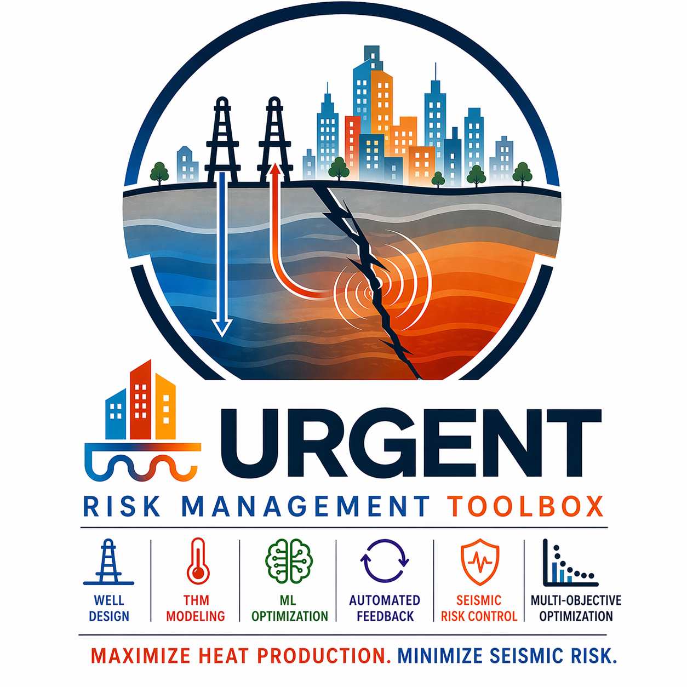

# URGENT Risk Management Toolbox

<p align="center">
  
</p>

<p align="center">
  
  
  
  
  
  
  
</p>

## Table of Contents
- [Introduction](#introduction)
- [Core components](#core-components)
- [Development Requirements](#development-requirements)
- [Environment Installation](#environment-installation)
- [Getting started](#getting-started)
  - [Supported Reservoir Simulators](#supported-reservoir-simulators)
  - [Execution modes](#execution-modes)
  - [Plugin system](#plugin-system)
    - [Bundled plugin files](#bundled-plugin-files)
    - [Creating a custom plugin](#creating-a-custom-plugin)
      - [Connector plugin](#connector-plugin)
      - [Optimizer plugin](#optimizer-plugin)
      - [Domain Service plugin](#domain-service-plugin)
  - [Reservoir simulation interoperability](#reservoir-simulation-interoperability)
    - [OpenDarts Connector](#opendarts-connector)
  - [Run configuration file](#run-configuration-file)
    - [Input file schemas](#input-file-schemas)
  - [Checkpointing and resuming runs](#checkpointing-and-resuming-runs)
- [Implemented services](#implemented-services)
   - [Well design service](#well-design-service)
- [Configuration example](#configuration-example)
- [Known issues](#known-issues)
- [Contact](#contact)

## Introduction

This Python-based toolbox is designed to optimize geothermal reservoir development by combining advanced Thermo-Hydro-Mechanical (THM) numerical modeling, machine learning (ML) optimization routines, and automated feedback loops. The goal is to maximize total heat energy production while minimizing the risk of induced seismicity on known faults.

## Core Components

1. **THM Reservoir Models**

    Simulate the coupled thermal, hydraulic, and mechanical behavior of the subsurface, based on geological models derived from seismic data.

2. **Machine Learning Optimization**

    Algorithms adjust well locations and operational parameters (e.g., flow rate, injection temperature) to balance maximum heat recovery with minimal seismic risk.

3. **Linking & Automation Scripts**

    Scripts facilitate communication between the THM simulations and ML routines, enabling iterative simulation cycles to determine optimal well placement and operation.

---

## Development Requirements

- **Operating System**: Ubuntu 22.04, Ubuntu 24.04
- **Python Version**: 3.12 (managed via pixi; configured in `pyproject.toml`)
- **Common Unix tools**: git, curl

---

## Environment Installation


You can install either a **development environment** (recommended for developers) or a streamlined **release environment**.


### Development Environment

Installs the tools needed for development (Python via pixi, dev dependencies, pre-commit):


```shell
pixi install -e dev
```

#### Repository Health Checks

Maintain codebase quality by executing pre-commit hooks, which will run set of the tools including pytest and coverage:

```shell
pixi run -e dev pre-commit run -a
```

#### Logs and artifacts pruning
To clean toolbox logs and produced artifacts run following pixi task:
``` shell
pixi run -e dev clean-all
```

### Release Environment
Installs the runtime dependencies:
```shell
pixi install
```

---

## Getting started

### 1. Supported Reservoir Simulators
#### OPEN-DARTS
- OpenDarts (1.1.3) [open_darts-1.1.3-cp312-cp312-linux_x86_64.whl]

### 2. Execution modes

The toolbox supports two execution modes for running simulations:

- Threaded runner (default): local execution without containers.

```shell
pixi run python src/main.py --config-file <config_filepath> --model-file <model_filepath>
```

- Docker runner: containerized workers (required Docker installation).

```shell
pixi run python src/main.py --config-file <config_filepath> --model-file <model_filepath> --use-docker
```

To resume an interrupted optimization run from a checkpoint file, use `--resume` instead of `--config-file` (see [Checkpointing and resuming runs](#checkpointing-and-resuming-runs)):

```shell
pixi run python src/main.py --resume <checkpoint_filepath.npz> --model-file <model_filepath>
```

> **Note:** `--config-file` and `--resume` are mutually exclusive. Exactly one must be supplied.

---

### 3. Plugin system

The toolbox uses an explicit plugin system to select the reservoir simulator connector, optimization algorithm, and domain service. **Every configuration file must include a `plugins` block** — there are no implicit defaults.

```json
"plugins": {
  "connector": "opendarts",
  "optimizer": "pso",
  "domain_service": "builtin"
}
```

Each value is a plugin name that maps to a file in `plugins/<type>/<name>.py`. The toolbox loads only the selected plugin at startup and validates the exported `plugin` descriptor.

#### Bundled plugin files

The repository includes these plugin files as examples and ready-to-select
implementations. They are not defaults: each run must still name the desired
connector, optimizer, and domain service in its config.

| Kind | Name | Description |
|------|------|-------------|
| `connector` | `opendarts` | OpenDARTS reservoir simulator connector |
| `optimizer` | `pso` | Particle Swarm Optimization engine |
| `domain_service` | `builtin` | Geometric well design service (IWell / JWell / SWell / HWell) |

---

#### Creating a custom plugin

The scaffolder generates a one-file plugin template derived from the live interface. Run the appropriate command and implement the generated stubs.

##### Connector plugin

A connector plugin handles launching the simulator subprocess and capturing its results.

```shell
pixi run create-plugin simulation MySimulator
```

This creates `plugins/connectors/mysimulator.py`:

```python
# plugins/connectors/mysimulator.py
from __future__ import annotations

import threading

from services.simulation_service.core.connectors.common import (
    ConnectorInterface,
    JsonPath,
    SimulationResults,
    SimulationStatus,
)
from urgent_plugins import ConnectorPlugin


class MySimulatorConnector(ConnectorInterface):
    ConnectorName = "mysimulator"

    @staticmethod
    def run(
        config_path: JsonPath,
        user_cost_function_with_default_values: SimulationResults,
        stop: threading.Event | None = None,
    ) -> tuple[SimulationStatus, SimulationResults]:
        raise NotImplementedError


plugin = ConnectorPlugin(
    name=MySimulatorConnector.ConnectorName,
    implementation=MySimulatorConnector,
)
```

Implement `run(...)`, then select the connector in your config:

```json
"plugins": {
  "connector": "mysimulator",
  "optimizer": "pso",
  "domain_service": "builtin"
}
```

The plugin file is automatically staged into each worker's runtime directory — no manual copying required.

---

##### Optimizer plugin

An optimizer plugin drives the search strategy over the parameter space.

```shell
pixi run create-plugin algorithm GeneticAlgorithm
```

This creates `plugins/optimizers/geneticalgorithm.py`:

```python
# plugins/optimizers/geneticalgorithm.py
from __future__ import annotations

from services.solution_updater_service.core.engines.common import (
    OptimizationEngineInterface,
)
from urgent_plugins import OptimizerPlugin


class GeneticAlgorithmEngine(OptimizationEngineInterface):
    EngineName = "geneticalgorithm"

    # implement all abstract methods from OptimizationEngineInterface
    ...


plugin = OptimizerPlugin(
    name=GeneticAlgorithmEngine.EngineName,
    implementation=GeneticAlgorithmEngine,
)
```

Select it in config:

```json
"plugins": {
  "connector": "opendarts",
  "optimizer": "geneticalgorithm",
  "domain_service": "builtin"
}
```

---

##### Domain Service plugin

A domain service plugin converts candidate well models into simulation geometry. It runs entirely in the orchestrator — never in simulation workers. The framework handles initial state construction, PSO boundary extraction, and task packaging; the plugin is responsible only for the geometry conversion step.

```shell
pixi run create-plugin domain CompanyDomainService
```

This creates `plugins/domain_services/companydomainservice.py`:

```python
# plugins/domain_services/companydomainservice.py
from __future__ import annotations

from typing import Any

from services.problem_dispatcher_service.core.service.interface import DomainServiceInterface
from services.well_management_service.core.models import WellDesignServiceResponse
from urgent_plugins import DomainServicePlugin


class CompanyDomainService(DomainServiceInterface):
    ServiceName: str = "companydomainservice"

    def process_request(self, request_dict: dict[str, Any]) -> WellDesignServiceResponse:
        raise NotImplementedError


plugin = DomainServicePlugin(
    name=CompanyDomainService.ServiceName,
    implementation=CompanyDomainService,
)
```

`process_request` receives a request dictionary shaped like `{"models": [...]}` and must return a `WellDesignServiceResponse`. It can wrap an external geometry engine, an HTTP service, or any domain-specific well-building logic.

Select it in config:

```json
"plugins": {
  "connector": "opendarts",
  "optimizer": "pso",
  "domain_service": "companydomainservice"
}
```

---

### 4. Reservoir simulation interoperability

Interoperability between the reservoir simulator and the Toolbox is achieved through the connector plugin
(`plugins/connectors/`).

The connector enables bidirectional data exchange between the Toolbox and the simulator, including:
- simulation configuration (control vectors),
- simulation results (objective function values).

---

#### 4.1 OpenDarts Connector

> *Note: Make sure you run OpenDarts with the set_num_threads(1) to prevent toolbox performance degradation*
>
> check main.py in examples/complex_model
``` python
from darts.engines import set_num_threads
...


set_num_threads(1)
```

1. **Simulation entry point**

   The reservoir simulation **must** be launched from a file named **`main.py`**.
   The file name must be preserved.

2. **Required imports**

   Add the following dependencies to the simulation entry point:

   ```python
   from connectors.opendarts import OpenDartsConnector
   from connectors.opendarts import open_darts_input_configuration_injector
   ```

   > **Note:**
   > The `connectors` package is automatically transferred from the Toolbox to the simulation model directory.
   > No user action is required.

3. **Configuration injection**

   The simulation entry-point function must be decorated with
   `open_darts_input_configuration_injector`:

   ```python
   @open_darts_input_configuration_injector
   def run_darts(injected_configuration) -> None:
       ...
   ```

   The `injected_configuration` contains the control vector for the optimization process.
   It is **strongly recommended** to pass this configuration to the model during initialization:

   ```python
   @open_darts_input_configuration_injector
   def run_darts(injected_configuration, ...) -> None:
       model = Model(configuration=injected_configuration)
   ```

   ```python
   class Model(DartsModel):
       def __init__(self, configuration, ...):
           self._configuration = configuration
           super().__init__()
           ...
   ```

   This ensures that the injected configuration is accessible throughout the entire `DartsModel` instance.

4. **Well connections**

   Well connections are extracted from the injected configuration using
   `OpenDartsConnector.get_well_connection_cells(...)`.

   Ensure the following import is present:

   ```python
   from connectors.opendarts import OpenDartsConnector
   ```

   Wells must be defined in the `set_wells` method of the simulation model:

   ```python
   def set_wells(self):

       wells = OpenDartsConnector.get_well_connection_cells(
           self._configuration, self.reservoir
       )

       for well_name, cells in wells.items():
           self.reservoir.add_well(well_name)
           for i, j, k in cells:
               self.reservoir.add_perforation(
                   well_name,
                   cell_index=(i, j, k),
                   multi_segment=False
               )
   ```

5. **Returning objective function values**

   To return an objective function value to the Toolbox, use
   `OpenDartsConnector.broadcast_result(...)`:

   ```python
   from connectors.opendarts import OpenDartsConnector

   OpenDartsConnector.broadcast_result(
       "Heat",
       heat_value
   )
   ```

   The result is transmitted back to the Toolbox with the corresponding name as ex.: "HEAT".
> Note: The parameters name must be the same as the one defined in the run configuration file.


6. **Optimization readiness**

   Once implemented as described above, the simulation model is ready to be used in an optimization workflow with **RiskManagementToolbox**.

7. **Packaging requirements**

   All simulation model files must be archived in a single `.zip` file.
   After extraction, all files must be located directly in the root directory (no nested subfolders).


### 5. Run configuration file
RiskManagementToolbox is designed to use JSON configuration file, where the user defines the optimization problem(s), initial state, and variable constraints.

Configuration file define services to be used for simulation and optimization as well as the global optimization parameters as objectives or linear inequality constraints.

The toolbox expects **one JSON file** that defines:

1. Services name and parameters for optimization (with their bounds)
2. Which plugins to use (connector, optimizer, domain service)
3. How the optimization algorithm is configured

### Input file schemas

Input configuration file is a JSON file with the structures presented in `schemas/x.y.z.json`

### Top-level structure:

```json
{
   "run_mode": "optimization",
   "=== SERVICE NAME ===": service item(s),
   "optimization_parameters": { ... },
   "simulation_config": { ... },
   "plugins": {
     "connector": "<name>",
     "optimizer": "<name>",
     "domain_service": "<name>"
   }
}
```

> **Important:** The `plugins` block is **required**. The toolbox will not start without it.

#### Run Mode

The optional `run_mode` field controls how the toolbox executes. It accepts two values:

| Value | Description |
|-------|-------------|
| `optimization` | *(Default)* Runs the full iterative optimization loop using the configured algorithm. `objectives` and `parameter_bounds` are required. |
| `evaluation` | Runs a single simulation using the `initial_state` values without optimization. Useful for validating that the simulation model and connector are correctly configured before committing to a full optimization run. In this mode `objectives` and `parameter_bounds` are not required, and all loop-control parameters (`population_size`, `max_generations`, `max_stall_generations`, `worker_count`) are automatically set to `1`. |

> **Note:** Omitting `run_mode` is equivalent to `"run_mode": "optimization"`.

### 6. Checkpointing and resuming runs

Long optimization runs can be interrupted at any time (e.g., due to a crash or manual stop). The toolbox saves periodic **checkpoints** so that work is not lost and the run can be continued from where it left off, rather than starting from scratch.

#### How checkpoints work

- A checkpoint is saved every `checkpoint_interval` completed generations (configured in `simulation_config`).
- Checkpoints capture the full optimizer state and the problem configuration.
- Files are written atomically to `checkpoint_path` and named `checkpoint_<run_id>.npz`.
- On successful completion the toolbox deletes the checkpoint file automatically.

#### Resuming a run

Pass the checkpoint file with `--resume` instead of `--config-file`:

```shell
pixi run python src/main.py \
    --resume checkpoints/checkpoint_a1b2c3d4.npz \
    --model-file path/to/model.zip
```

The problem configuration (objectives, well design, bounds, etc.) is restored directly from the checkpoint — no separate `--config-file` is needed.

> **Note:** The toolbox validates that the model file provided at resume time matches the one used when the checkpoint was created, using a SHA-256 hash. Providing a different model will raise an error.

#### Checkpoint configuration example

```json
"simulation_config": {
  "worker_count": 4,
  "worker_simulation_timeout_seconds": 900,
  "server_job_timeout_seconds": 3600,
  "checkpoint_interval": 5,
  "checkpoint_path": "checkpoints"
}
```

With `checkpoint_interval: 5`, a checkpoint is saved after generations 5, 10, 15, and so on. If the run is interrupted at generation 13, resuming will continue from generation 10 (the most recent saved checkpoint).

---

## Implemented services

| Service name  | Description                                                            |
|---------------|------------------------------------------------------------------------|
| `well_design` | Service responsible for well(s) placement, trajectory and completion.  |


### Well design service

`well_design` expecting is an array of objects (service items):

```json
{
  "well_name": "INJ",
  "initial_state": { ... },
  "parameter_bounds": { ... }
}
```

#### Mandatory fields

| Field | Required | Description |
|----|----|----|
| `well_name` | ✅ | Unique identifier used across the configuration |
| `initial_state` | ✅ | Defines well initial (user defined) geometry and completion |
| `parameter_bounds` | ✅ (optimization mode) | Selects which parameters (from initial state) are optimized, with the lower and upper range. Not required in `evaluation` mode. |

### Initial state
The `initial_state` defines the **baseline geometry** of a well.

#### Common fields
| Field | Required | Description |
|----|----|----|
| `wellhead` | ✅ | XYZ coordinates of wellhead ex. {"x": 400,"y": 400, "z": 0}  |
|`perforations`| ❌ | Optional (but well without perforation may be skipped in simulator - check the worker log(s) file):: dictionary of name and perforation interval of well in measure depth ex. {"perforation_1": {"start_md":  1000.00, "end_md": 1200.00}, "perforation_2":{"start_md": 1500, "end_md": 1550}}|
| `md_step` | ❌ | Optional:  well trajectory discretization step, default: `0.5 m`, `≥ 0.1m` |

Data Validation Rules
- **Perforation Alignment**: Any perforation defined beyond the well's total `md` is automatically truncated. Intervals starting after the total `md` are discarded.
- **Overlap Detection**: The system ensures no two perforation intervals overlap.
- **Automatic Sorting**: Perforations are automatically ordered by their start depth.


The well type is selected using the `well_type` discriminator:

| well_type | Model | Description |
|---------|------|------------|
| `IWell` | IWellModel | Vertical well |
| `JWell` | JWellModel | Build-and-hold well (J shape) |
| `SWell` | SWellModel | Multi-curvature well (S shape) |
| `HWell` | HWellModel | Horizontal well |

#### Vertical well

The `IWell` represents a straight, inclined well trajectory. It is defined by its surface location, total measured depth, and calculation resolution.

| Field | Type | Description | Constraints |
| :--- | :--- | :--- | :--- |
| `well_type` | Literal | Fixed identifier for the trajectory type. | Must be `IWell` |
| `md` | Float | **Measured Depth**: Total length of the wellbore. | `> 0.0` |


Example:
``` json
{
  "well_type": "IWell",
  "md": 2500.0,
  "wellhead": {
    "x": 1450.0,
    "y": 2200.0,
    "z": 0.0
  },
  "md_step": 0.5,
  "perforations": {
   "p1":
    {
      "start_md": 1800.0,
      "end_md": 1950.0
    }
  }
}
```


#### J shape well

The `JWell` represents a directional well trajectory consisting of an initial vertical/linear section, a curved build section, and a final tangential linear section.

| Field | Type | Description | Constraints |
| :--- | :--- | :--- | :--- |
| `well_type` | Literal | Fixed identifier for the trajectory type. | Must be `JWell` |
| `md_linear1` | Float | **Initial Linear Section**: Length of the first straight section. | `> 0.0` |
| `md_curved` | Float | **Curved Section**: Length of the build/curve section. | `> 0.0` |
| `dls` | Float | **Dogleg Severity**: Curvature rate of the build section in °/30m. The positive value define anticlockwise build direction | `-45.0` to `45.0` |
| `md_linear2` | Float | **Final Linear Section**: Length of the final tangential section. | `> 0.0` |
| `azimuth` | Float | Azimuth of the well in degrees. | `0.0` to `< 360.0` |


Example:
```JSON
{
  "well_type": "JWell",
  "md_linear1": 500.0,
  "md_curved": 300.0,
  "dls": 5.0,
  "md_linear2": 700.0,
  "wellhead": {
    "x": 1000.0,
    "y": 1000.0,
    "z": 0.0
  },
  "azimuth": 45.0,
  "md_step": 0.5,
  "perforations": {
   "p1":
    {
      "start_md": 1200.0,
      "end_md": 1450.0
    }
  }
}
```

#### S shape well

The `SWell` represents a complex directional well trajectory with two curved sections, often used to offset the lateral position of the wellbore while maintaining a final vertical or tangential orientation.

| Field | Type | Description | Constraints |
| :--- | :--- | :--- | :--- |
| `well_type` | Literal | Fixed identifier for the trajectory type. | Must be `SWell` |
| `md_linear1` | Float | **First Linear Section**: Initial straight section. | `> 0.0` |
| `md_curved1` | Float | **First Curve**: Length of the first build/drop section. | `> 0.0` |
| `dls1` | Float | **First DLS**: Dogleg Severity for the first curve in °/30m. The positive value define anticlockwise build direction  | `-45.0` to `45.0` |
| `md_linear2` | Float | **Second Linear Section**: Intermediate straight section. | `> 0.0` |
| `md_curved2` | Float | **Second Curve**: Length of the second build/drop section. | `> 0.0` |
| `dls2` | Float | **Second DLS**: Dogleg Severity for the second curve in °/30m. The positive value define anticlockwise build direction  | `-45.0` to `45.0` |
| `md_linear3` | Float | **Third Linear Section**: Final straight section. | `> 0.0` |
| `azimuth` | Float | The horizontal direction of the well in degrees. | `0.0` to `< 360.0` |


Example:
``` JSON
{
  "well_type": "SWell",
  "md_linear1": 400.0,
  "md_curved1": 200.0,
  "dls1": 5.0,
  "md_linear2": 500.0,
  "md_curved2": 300.0,
  "dls2": -3.0,
  "md_linear3": 600.0,
  "wellhead": {
    "x": 500.0,
    "y": 500.0,
    "z": 0.0
  },
  "azimuth": 180.0,
  "md_step": 0.5,
  "perforations": {
   "p1":
    {
      "start_md": 1600.0,
      "end_md": 1900.0
    }
  }
}
```

#### Horizontal well


The `HWell` represents a horizontal well trajectory defined by a specific True Vertical Depth (TVD) and a lateral extension (width). The system automatically calculates the necessary build curve to transition from the wellhead to the horizontal section using dls of 4.0° /30m

| Field | Type | Description | Constraints |
| :--- | :--- | :--- | :--- |
| `well_type` | Literal | Fixed identifier for the trajectory type. | Must be `HWell` |
| `TVD` | Float | **True Vertical Depth**: The vertical depth of the horizontal lateral. | `> 0.0` |
| `md_lateral` | Float | **Lateral Length**: The length of the horizontal section. | `> 0.0` |
| `azimuth` | Float | The horizontal direction of the lateral in degrees. | `0.0` to `< 360.0` |


Example:
```json
{
  "well_type": "HWell",
  "TVD": 1000.0,
  "md_lateral": 1500.0,
  "wellhead": {
    "x": 2000.0,
    "y": 2000.0,
    "z": 0.0
  },
  "azimuth": 90.0,
  "md_step": 1.0,
  "perforations": {
   "p1":
    {
      "start_md": 1200.0,
      "end_md": 2500.0
    }
  }
}
```

#### Data Validation Rules
- **Geometry Check**: The `TVD` must be sufficient to accommodate the calculated curvature radius of the build section.
- **Automatic MD Calculation**: The total Measured Depth is automatically derived from the vertical transition and lateral width for perforation clipping.


### Optimization constraints


Optimization constraints (`parameter_bounds`) define the boundaries for individual well parameters

####  Parameter Boundaries
Boundaries define the search space (Lower Bound and Upper Bound) for specific well attributes.

 **The optimizing well attribute has to present in initial state.**

| Field | Type | Description |
| :--- | :--- | :--- |
| `parameter_bounds` | Dictionary | Maps a variable name to a {"lb": float, "ub": float} |

> Important!
>> For nested parameters like wellhead coordinates or perforations, the following naming convention is used:
>
>  "main_parameter":{ "sub_parameter": {"sub_sub_parameter" :{ "lb": xxx, "ub": yyy }}} example:

Example:
```JSON
  "parameter_bounds": {
    "wellhead": {
      "x": {
        "lb": 10,
        "ub": 3190
      },
      "y": {
        "lb": 10,
        "ub": 3190
      }
    },
    "md": {
      "lb": 2000,
      "ub": 2700
    },
    "perforations": {
      "p1": {
        "start_md": {
          "lb": 2000,
          "ub": 2200
        }
      }
    }
  }
```

### Optimization Parameters Section

The toolbox uses the `optimization_parameters` block to define how the optimization engine (e.g., PSO) behaves and to set global constraints across multiple wells.

####
These settings control the execution and termination of the optimization process.

| Parameter | Type            | Default  | Description                                                                                                                                                                                                                                                                                                              |
| :--- |:----------------|:---------|:-------------------------------------------------------------------------------------------------------------------------------------------------------------------------------------------------------------------------------------------------------------------------------------------------------------------------|
| `objectives` | dict[str, str]  | REQUIRED | Dictionary of objective to optimize with optimization strategy ex. {"Heat": "maximize", "WellLength": "minimize"}. The objective names must match the values broadcasted from connector, otherwise the optimization run will be aborded. If multiple objectives are present the RMT will run in pareto optimization mode. |
| `max_generations` | Integer         | `10`     | Maximum number of iterations for the algorithm.                                                                                                                                                                                                                                                                          |
| `population_size` | Integer         | `10`     | Number of solution candidates to evaluate per generation.                                                                                                                                                                                                                                                                |
| `max_stall_generations` | Integer         | `10`     | Generations to wait for improvement before early stopping.                                                                                                                                                                                                                                                               |
| `seed` | Integer \| null | `null`   | Random seed for the optimization algorithm. Set to an integer value to make runs reproducible. When `null`, results will vary between runs.                                                                                                                                                                              |
| `linear_inequalities` | see below       |`null` | Dictionary of linear inequality constraints.

#### Linear inequalities allow you to define relationships between variables across different wells, such as a combined "drilling budget" for total measured depth.

- **A**: List of coefficient maps. Variables must be named as `service_name.attribute.subattribute` (e.g., `well_design.PRO.md` or `well_design.INJ.perforations.p1.start_md`).
- **b**: List of constant values (right-hand side of the inequality).
- **sense**: List of operators (`<=`, `>=`, `<`, `>`). Defaults to `<=` if omitted.

> Important!
>> The number of rows in `A` and `b` must match the number of variables in the optimization space.

>> For perforation optimization make sure that end_md of perforation is greater than start_md

### Simulation Config Section

The `simulation_config` block defines the execution environment parameters, such as the number of parallel simulator instances and timeout thresholds for simulations.

| Parameter | Type           | Default  | Description                                                                                                                                                                                                                                                                                                              |
| :--- |:---------------|:---------|:-------------------------------------------------------------------------------------------------------------------------------------------------------------------------------------------------------------------------------------------------------------------------------------------------------------------------|
| `worker_count` | Integer        | `4`      | Number of parallel simulation workers (limited by physical CPU cores).                                                                                                                                                                                                                                                   |
| `worker_simulation_timeout_seconds` | Integer | `900` | Maximum time allowed (in seconds) for a single simulation worker to complete its assigned simulation run before it is forcefully terminated. |
| `server_job_timeout_seconds` | Integer | `3600` | Maximum time allowed (in seconds) for the entire server batch job to complete. |
| `checkpoint_interval` | Integer | `5` | Save an optimizer checkpoint every N completed generations. |
| `checkpoint_path` | String (path) | `checkpoints/` | Directory where checkpoint `.npz` files are written. Created automatically if it does not exist. |

Example:
```json
"simulation_config": {
  "worker_simulation_timeout_seconds": 900,
  "server_job_timeout_seconds": 3600,
  "worker_count": 2,
  "checkpoint_interval": 10,
  "checkpoint_path": "checkpoints"
}
```


#### Example: Combined Depth Constraint
To ensure the total length of two wells (`INJ` and `PRO`) is between 1200m and 5000m:

```json
"optimization_parameters": {
  "objectives": {"HEAT": "maximize"},
  "population_size": 20,
  "linear_inequalities": {
    "A": [
      { "well_design.INJ.md": 1.0, "well_design.PRO.md": 1.0 },
      { "well_design.INJ.md": 1.0, "well_design.PRO.md": 1.0 }
    ],
    "b": [1200.0, 5000.0],
    "sense": [">=", "<="]
  }
}
```
## Configuration example
### **Case Summary:**

The Well design service will be use to determine the optimal wells placement and trajectory for maximizing the heat production.

1. **Search Space**:
    - The injector (`INJ`) is confined to a 900m x 900m square in the bottom-left area.
    - The producer (`PRO`) is confined to a 1500m x 1500m square in the top-right area.
    - Both wells can vary in depth between **1500m** and **3000m**.

2. **Linear Constraint**: The total combined depth of both wells is restricted to **5000 meters** maximum (enforced via ). `linear_inequalities`
3. **Strategy**: The engine will attempt to **maximize** the objective function (e.g., heat production) over **50 generations** using **4 parallel workers**.
4. **Completions**:
    - `INJ` has a fixed 500m perforation at the toe.
    - `PRO` has no perforations defined in , so the system will default to perforating its entire length. `initial_state`
5. **Optimization strategy**:
	User defined parameter "HEAT" should be "maximized"

```json
{
  "well_design": [
    {
      "well_name": "INJ",
      "initial_state": {
        "well_type": "IWell",
        "md": 2500.0,
        "md_step": 1.0,
        "wellhead": {
          "x": 500.0,
          "y": 500.0,
          "z": 0.0
        },
        "perforations": {
          "p1": {
            "start_md": 2000.0,
            "end_md": 2500.0
          }
        }
      },
      "parameter_bounds": {
        "wellhead": {
          "x": {
            "lb": 100.0,
            "ub": 1000.0
          },
          "y": {
            "lb": 100.0,
            "ub": 1000.0
          }
        },
        "md": {
          "lb": 1500.0,
          "ub": 3000.0
        }
      }
    },
    {
      "well_name": "PRO",
      "initial_state": {
        "well_type": "IWell",
        "md": 2500.0,
        "md_step": 1.0,
        "wellhead": {
          "x": 1500.0,
          "y": 1500.0,
          "z": 0.0
        },
        "perforations": {
          "p1": {
            "start_md": 2100.0,
            "end_md": 2200.0
          }
        }
      },
      "parameter_bounds": {
        "wellhead": {
          "x": {
            "lb": 1000.0,
            "ub": 2500.0
          },
          "y": {
            "lb": 1000.0,
            "ub": 2500.0
          }
        },
        "md": {
          "lb": 1500.0,
          "ub": 3000.0
        }
      }
    }
  ],
  "optimization_parameters": {
    "objectives": {
      "HEAT": "maximize"
    },
    "max_generations": 50,
    "population_size": 20,
    "max_stall_generations": 5,
    "linear_inequalities": {
      "A": [
        {
          "well_design.INJ.md": 1.0,
          "well_design.PRO.md": 1.0
        }
      ],
      "b": [
        5000.0
      ],
      "sense": [
        "<="
      ]
    }
  },
  "simulation_config": {
    "worker_simulation_timeout_seconds": 900,
    "server_job_timeout_seconds": 3600,
    "worker_count": 4,
    "checkpoint_interval": 5,
    "checkpoint_path": "checkpoints"
  },
  "plugins": {
    "connector": "opendarts",
    "optimizer": "pso",
    "domain_service": "builtin"
  }
}


```

## Contact
For issues or contributions, please open a GitHub issue or contact the maintainers.
